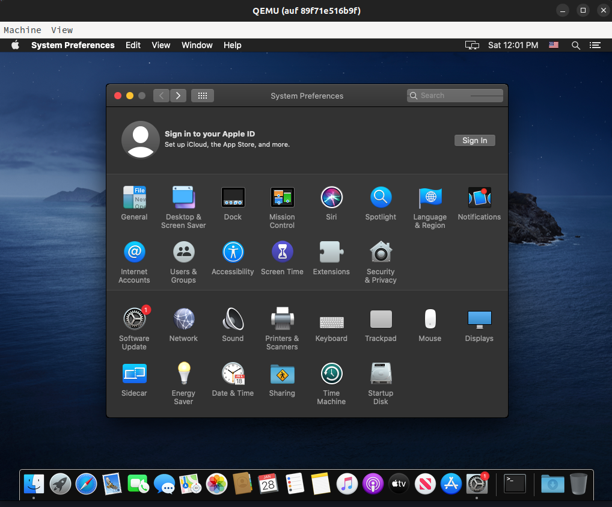
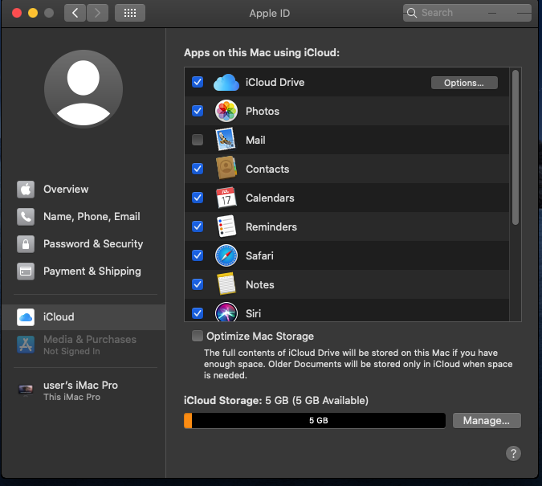
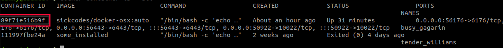

### How to setup your MacOS

### Requirements

- [Docker](https://www.docker.com/) installed
- If you are on Windows host, install (Windows Subsystem for Linux) and run all commands there
- If you already own a mac and just want to use headless haystack you can jump directly to [Install Headless Haystack](#install-headless-haystack)

### Download and start your docker container

- To start the docker container the first time run:

```
docker run -it \
    --device /dev/kvm \
    -p 50922:10022 \
    -p 56176:6176 \
    -p 56443:6443 \
    -v /tmp/.X11-unix:/tmp/.X11-unix \
    -e "DISPLAY=${DISPLAY:-:0.0}" \
    -e GENERATE_UNIQUE=true \
    -e ADDITIONAL_PORTS='hostfwd=tcp::6176-:6176,hostfwd=tcp::6443-:6443,' \
    -e WIDTH=1024 \
    -e HEIGHT=768 \
    -e MASTER_PLIST_URL=https://raw.githubusercontent.com/dchristl/headless-haystack/main/OSX-KVM/custom.plist \
    sickcodes/docker-osx:auto
```    

> This command pulls the image from [Sickcodes](https://github.com/sickcodes/Docker-OSX) and may take a while. A customized plist is used, that disables the timeout during boot process. It exposes 3 ports to the host machine
> - 50922 for ssh 
> - 56176 for the fetchLocation webservice (Android application)
> - 56443 for the headless web UI 

___The default password for your Mac is 'alpine'___

### Prepare your Mac for running headless

<!-- - Install [Homebrew](https://brew.sh/) in terminal
```
/bin/bash -c "$(curl -fsSL https://raw.githubusercontent.com/Homebrew/install/HEAD/install.sh)"
``` -->

- Log in with your Apple ID. If you don't have any, [create a new one](https://appleid.apple.com/account). ***The default keyboard layout is en_US. If you have another one, change this in the system preferences.***



- Shutdown your Mac

___Do not restart your Mac until the next steps are successfully executed. All steps will be executed on your host, resp. wsl___ 

- Get the Docker-hash of your container
```
docker container ls --all
``` 


> If you have multiple docker containers , find the one with docker-osx in image name. In this example the correct one will be ___89f71e516b9f___

- Stop Docker
```
sudo systemctl stop docker
``` 
- Goto your container's folder. Change the folder name according to your hash. The folder is longer than the short hash!  
```
sudo su
cd /var/lib/docker/containers/89f71e516b9f_________
```
- Disable serial generation and enable headless mode
```
sed -i 's/GENERATE_UNIQUE=true/GENERATE_UNIQUE=false/g' config.v2.json
sed -i 's/DISPLAY=:0/DISPLAY=:99/g' config.v2.json
```
- Restart your docker container in headless mode with your hash
 ```
 docker start -ai 89f71e516b9f
 ```

### Install headless haystack

All commands will be executed in MacOs (virtual or real). <!-- Make sure [Homebrew](https://brew.sh/) is installed.  -->

- Download and unzip latest headless haystack
```
curl -L -O  https://github.com/dchristl/headless-haystack/releases/latest/download/macos-webapplication.zip
unzip macos-webapplication.zip -d webserver
```
- Browse to webserver folder, change the password if not 'alpine' 
```
cd webserver
# Change the password in line 'pwd = 'alpine'' at the beginning of the file
nano FindMy_proxy.py
```

- Start the fetch-location service
```
./FindMy_proxy.py
```

- Optional: You can now use the android application and fetch your records. If you want to use the web application, kill the fetch-location service and start it it in background
```
./FindMy_proxy.py &
```
Now start a simple HTTP-Server in the 'web'- folder on port 6443
```
cd web
python -m SimpleHTTPServer 6443
```
or  (if you are on python3)
```
cd web
python -m http.server 6443
```

You should now able to browse to [http://localhost:56443/](http://localhost:56443/) on your host and use headless haystack
