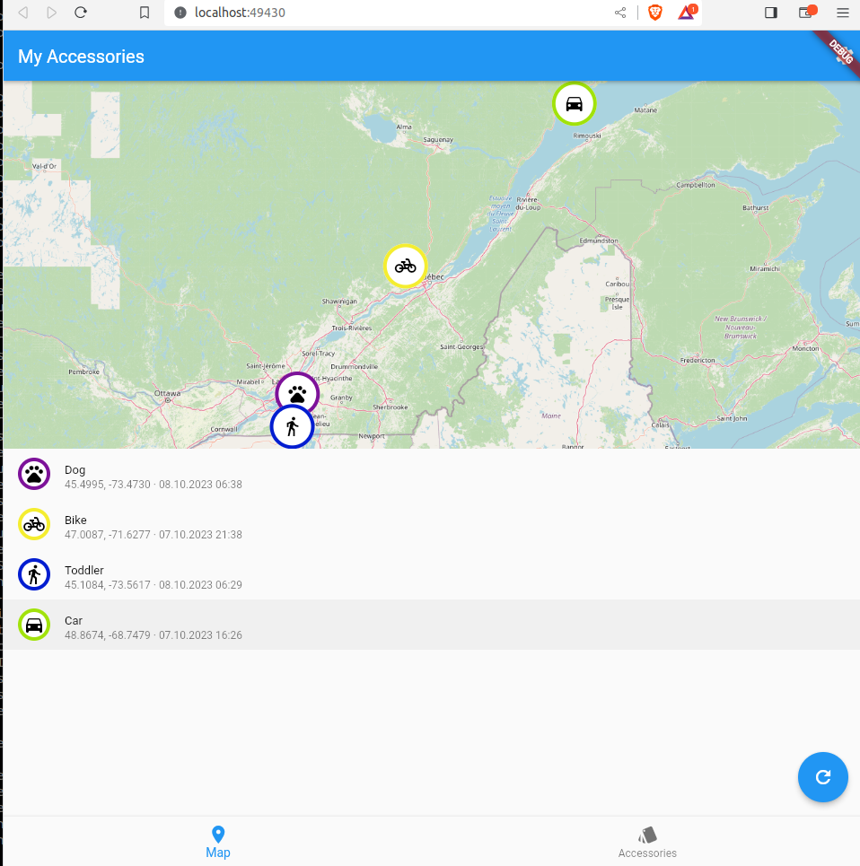
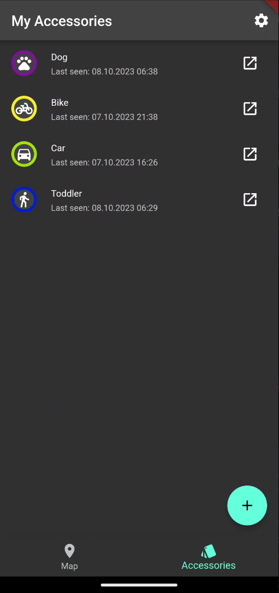
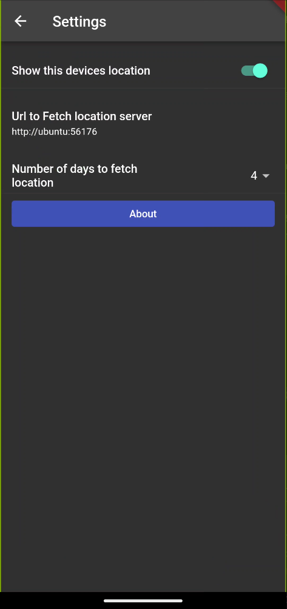
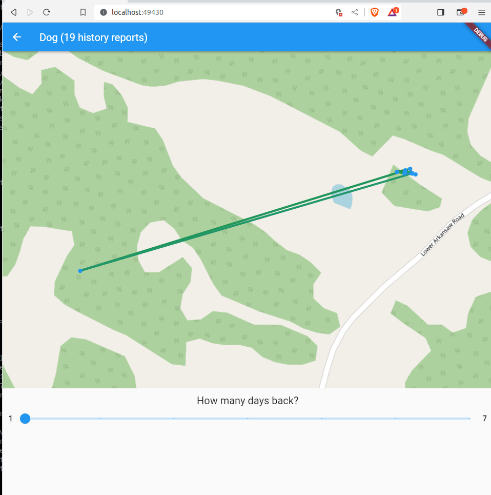
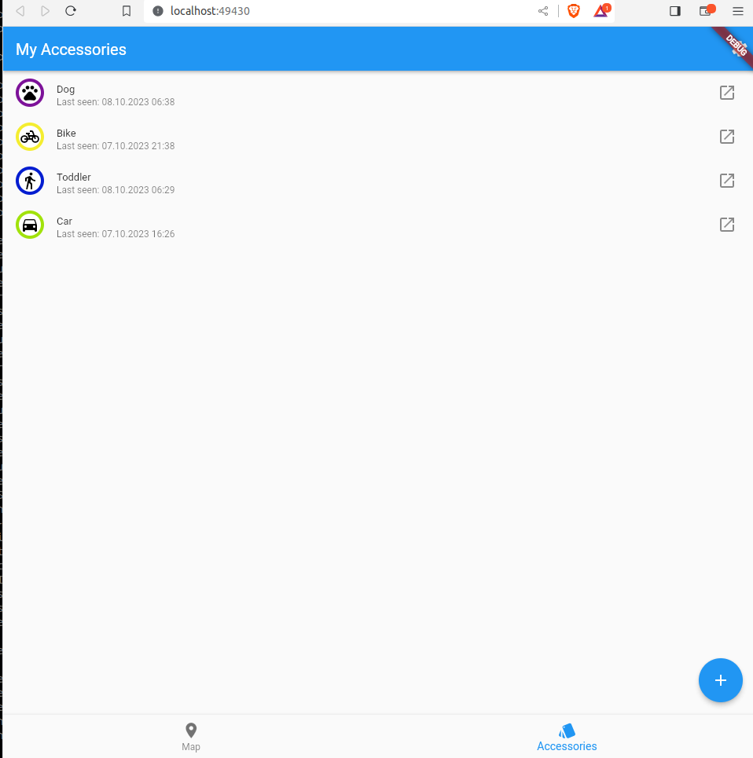

## Introduction

This project tries to unify several projects for simpler handling of custom BT-devices with Apple's FindMy network. The goal is to run a without the need to own a real Mac or setup a virtual Mac. Also you don't have to install the mail plugin or openhaystack itself.

***This is project is just a playground for checking technical feasibility and should not be used otherwise.***

Included projects are (Credits goes to them for the hard work):
- The original [Openhaystack](https://github.com/seemoo-lab/openhaystack)
    - Android application 
    - ESP32 firmware
- [Biemster's FindMy](https://github.com/biemster/FindMy)
    - The standalone python webserver for fetching the FindMy reports
- [Positive security's Find you](https://github.com/positive-security/find-you)
    - ESP32 firmware customization for battery optimization 
- [acalatrava's OpenHaystack-Fimware alternative](https://github.com/acalatrava/openhaystack-firmware)
    - NRF5x firmware customization for battery optimization 

## Changes to the original projects

### Openhaystack

Stripped down to the mobile application (Android) and ESP32 firmware. ESP32 firmware combined with FindYou project and optimizations in power usage. 
 

### Biemster's FindMy

Customization in keypair generator to output an array for the ESP32 firmware and a json for import in the Android application. 

## Instructions

### Prerequisites

- [Docker](https://www.docker.com/) installed
- [Python 3](https://www.python.org/) installed

### Set up device

- Run `generate_keys.py` to generate your key (e.g. `./generate_keys.py -p PREFIX`). All files will be in output-folder (All keys as information, PREFIX_keyfile for ESP32 and PREFIX_devices.json for import in application)
- [Install ESP32-firmware with your key](firmware/ESP32/README.md) or/and (see note)
- [Install NRF5x-firmware with your key](firmware/nrf5x/README.md) (see note)
> [!NOTE]  
> In general, any OpenHaystack-compatible device or its firmware is also compatible with Macless-Haystack (i.e. [the ST17H66](https://github.com/biemster/FindMy/tree/main/Lenze_ST17H66)). Typically, only the Base64-encoded advertisement key is required, which can be found in the .keys file after key generation.

### Set up endpoint/fetch location server

- Create a docker network

`docker network create mh-network`

- Install [Anisette Server](https://github.com/Dadoum/anisette-v3-server):

`docker run -d --restart always --name anisette -p 6969:6969 --volume anisette-v3_data:/home/Alcoholic/.config/anisette-v3/lib/ --network mh-network dadoum/anisette-v3-server`

- Install Macless Haystack endpoint:

`docker run -i --restart unless-stopped --name macless-haystack -p 6176:6176 --volume mh_data:/webserver/data/ --network mh-network christld/macless-haystack`

### Configure and install frontend

You can either use the frontend, provided by GitHub, host the webserver for yourself or use the Android application 

- *Optional*: Mobile: Install application
- *Optional*: Host: Browse to [Github Page](https://dchristl.github.io/macless-haystack/) (s. [Notes on SSL usage](OSX-KVM/README.md#notes-on-usage-on-other-machines-ssl))
- Import PREFIX_devices.json to your application
- *Optional*: If you run the frontend not on the same machine as your endpoint, you have to configure your Url in the settings

## Screenshots

### Android

### Web

