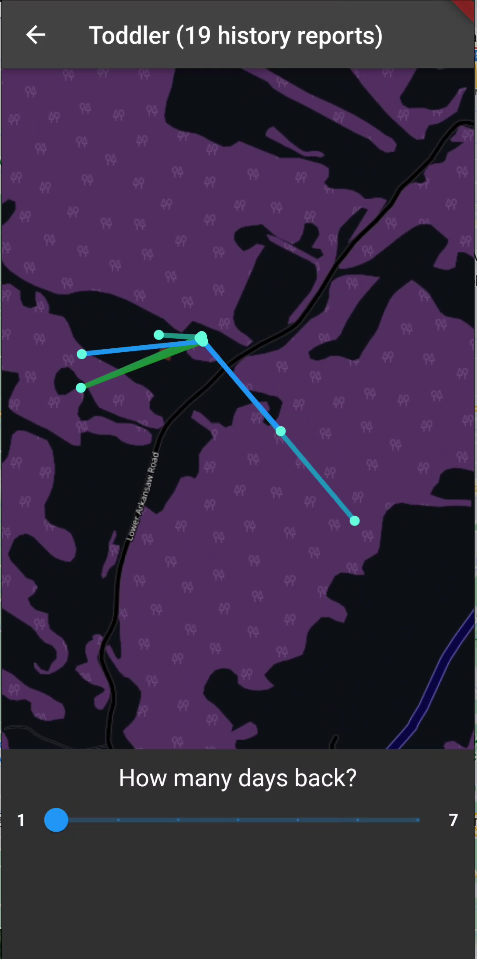
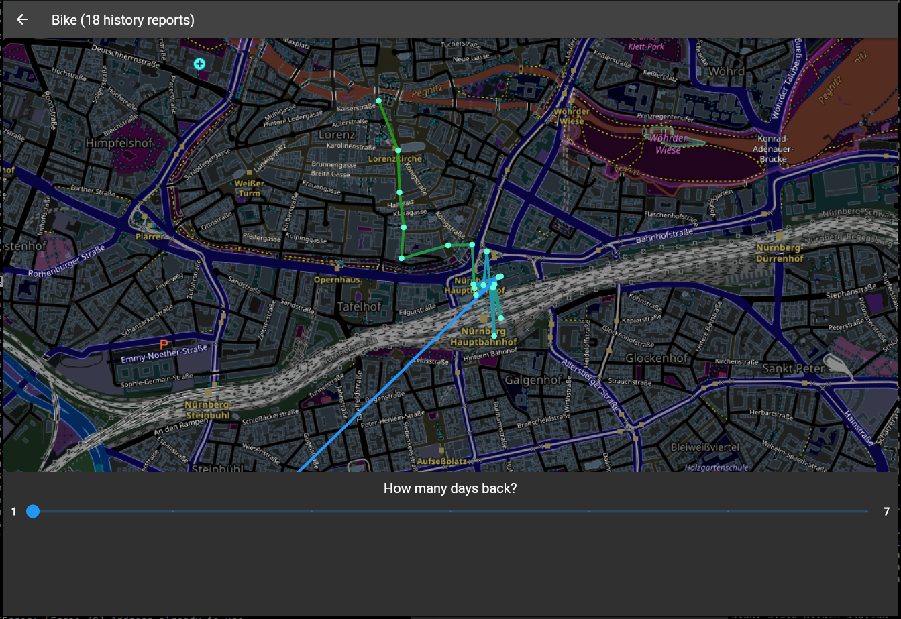

# Macless-Haystack


[](https://hub.docker.com/r/christld/macless-haystack)
[](https://hub.docker.com/r/christld/macless-haystack)


This project tries to unify several projects for an easy-to-use and easy-to-setup custom FindMy network. The goal is to run a FindMy network without the need to own a real Mac or virtual Mac. Also you don't have to install the mail plugin or openhaystack itself. (As needed by the original OpenHaystack project).


## Table of Contents

- [Setup](#setup)
  - [Prerequisites](#prerequisites)
  - [Hardware setup](#hardware-setup)
  - [Server setup](#server-setup)
  - [Frontend setup](#frontend-setup)
- [Problems / Issues / Questions](#problems--issues--questions)
- [Included projects and changes](#included-projects-and-changes)
- [Screenshots](#screenshots)

## Setup

In this section, you will find a step-by-step guide on how to set up your own Macless-Haystack network.

<details><summary>1. Prerequisites</summary>

## Prerequisites

- [Docker](https://www.docker.com/) installed
- [Python3](https://www.python.org/) and [pip3](https://pypi.org/project/pip/) installed
- Apple-ID with 2FA enabled. Only sms/text message as second factor is supported!

---

</details>

<details><summary>2. Hardware setup</summary>

## Hardware setup

1. Head over to the [releases](https://github.com/dchristl/macless-haystack/releases/latest) section and download `generate_keys.py` and your needed firmware (ESP32 or NRF5x) zip file.

2. Execute the `generate_keys.py` script to generate your keypair. (Note: dependency `cryptography` is needed. Install it with `pip install cryptography`)

3. Unzip the firmware and flash it to your device (see [Install ESP32-firmware with your key](firmware/ESP32/README.md) or [Install NRF5x-firmware with your key](firmware/nrf5x/README.md))

###### Note: In general, any OpenHaystack-compatible device or its firmware is also compatible with Macless-Haystack (i.e. [the ST17H66](https://github.com/biemster/FindMy/tree/main/Lenze_ST17H66)). Typically, only the Base64-encoded advertisement key is required, which can be found in the .keys file after key generation

---

</details>

<details><summary>3. Server setup</summary>

## Server setup

1. Create a new docker network

```bash
docker network create mh-network
```

2. Install [Anisette Server](https://github.com/Dadoum/anisette-v3-server):

```bash
docker run -d --restart always --name anisette -p 6969:6969 --volume anisette-v3_data:/home/Alcoholic/.config/anisette-v3 --network mh-network dadoum/anisette-v3-server
```

3. Start and set up your Macless Haystack endpoint in interactive mode:

```bash
docker run -it --restart unless-stopped --name macless-haystack -p 6176:6176 --volume mh_data:/app/endpoint/data --network mh-network christld/macless-haystack
```

###### You will be asked for your Apple-ID, password and your 2FA. If you see `serving at port 6176 over HTTP` you have all set up correctly

4. Restart your server now in background by restarting it in an other terminal

```bash
docker restart macless-haystack
```

---

</details>

<details><summary>4. Frontend setup</summary>

## Frontend setup

You can either use the frontend provided by GitHub, host the webserver for yourself or use the Android application

- *Optional*: Mobile: Install application
- *Optional*: Host: Browse to [Github Page](https://dchristl.github.io/macless-haystack/) (s. [Notes on SSL usage](FAQ.md#how-can-i-use-ssl-if-the-endpoint-runs-on-another-machine-than-the-ui))
- Import PREFIX_devices.json to your application
- If you run the frontend not on the same machine as your endpoint, you have to configure your Url in the settings

---

</details>

### Problems / Issues / Questions

If you have any problems, issues or questions, please check the [FAQ](FAQ.md) first. If this doesn't help you, create a new issue.

## Included projects and changes

Included projects are (Credits goes to them for the hard work):

- The original [Openhaystack](https://github.com/seemoo-lab/openhaystack)
  - Stripped down to the mobile application (Android) and ESP32 firmware. ESP32 firmware combined with FindYou project and optimizations in power usage.
  - Android application
  - ESP32 firmware
- [Biemster's FindMy](https://github.com/biemster/FindMy)
  - Customization in keypair generator to output an array for the ESP32 firmware and a json for import in the Android application.
  - The standalone python webserver for fetching the FindMy reports
- [Positive security's Find you](https://github.com/positive-security/find-you)
  - ESP32 firmware customization for battery optimization
- [acalatrava's OpenHaystack-Fimware alternative](https://github.com/acalatrava/openhaystack-firmware)
  - NRF5x firmware customization for battery optimization

## Screenshots

<details><summary>Android App</summary>

### Android





</details>

<details><summary>Website</summary>

### Web




</details>

## Contributing

Pull requests are welcome. Please fork from dev-branch. For major changes, please open an issue first to discuss what you would like to change.

[](https://www.gnu.org/licenses/agpl-3.0)

## Disclaimer

This repository is for research purposes only, the use of this code is your responsibility.

I take NO responsibility and/or liability for how you choose to use any of the source code available here. By using any of the files available in this repository, you understand that you are AGREEING TO USE AT YOUR OWN RISK. Once again, ALL files available here are for EDUCATION and/or RESEARCH purposes ONLY.
